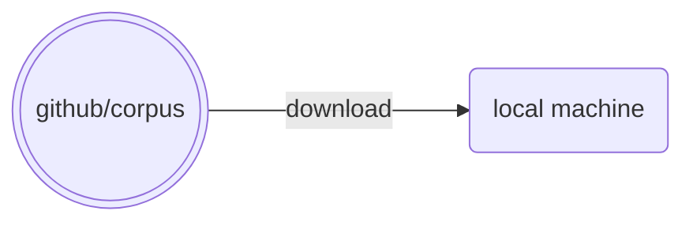
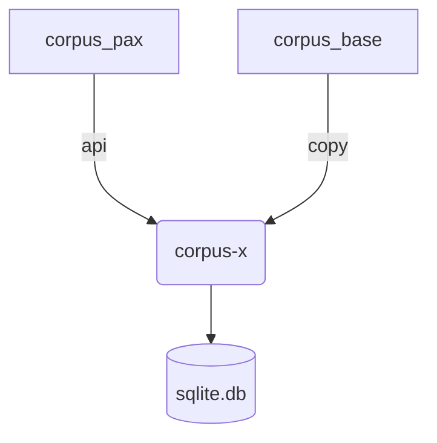
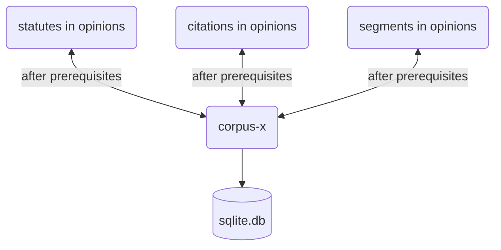
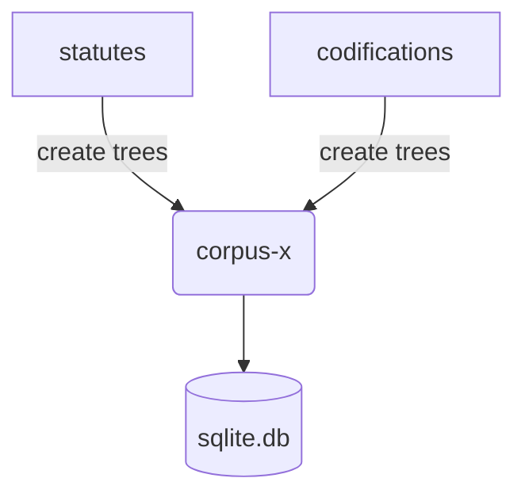
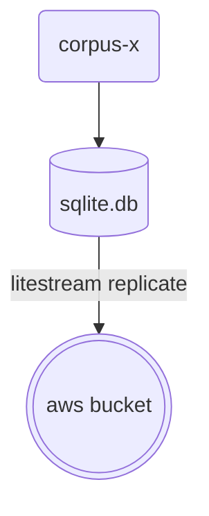

# corpus-x

## Concept

[corpus-pax](https://github.com/justmars/corpus-pax) + [corpus-base](https://github.com/justmars/corpus-base) + [statute-trees](https://github.com/justmars/statute-trees) = converts raw `yaml`-based corpus repository to its database variant **corpus-x**; see [details](notebooks/setup.ipynb). After constructing all of the required tables, it becomes possible to [evaluate the raw data](docs/5-db-evaluate.md).

## Flow

### Local files

Download *.yaml files from repository:



### Prerequisites



### Inclusions



### Trees



### Replication



## Mode

Order | Time | Instruction | Docs
:--:|:--:|--:|:--
1 | ~6sec (if with test data) | [corpus-pax](https://github.com/justmars/corpus-pax#read-me) pre-requiste before `corpus-base` can work. |[Setup](docs/1-setup.md)
2 | ~20min | [corpus-base](https://github.com/justmars/corpus-base#read-me) pre-requiste before `corpus-x` can work. |[Setup](docs/1-setup.md)
3 | ~70min | If inclusion files not yet created, run script to generate. |[Pre-inclusions](docs/2-pre-inclusions.md)
4 | ~30min | Assuming inclusion files are already created, can populate the various tables under `corpus-x` | [Post-inclusions](docs/3-post-inclusions.md)
5 | ~40 to ~60min | Litestream output `x.db` on AWS bucket | [Replicated db](docs/4-aws-replicate.md)

## Build from scratch

Assuming step 3 above has already been completed as a separate process, it takes about ~1 hour (60 min.) to create a database locally.

This is steps: 1, 2, and 4 combined:

```python shell
>>> from corpus_x.utils.setup import setup_x_db
>>> setup_x_db('x.db') # creates the database in present working directory
```

If just step 4 is needed:

```python shell
>>> from sqlpyd import Connection
>>> from corpus_x.utils.setup import setup_corpus_x
>>> db_path = 'x.db'
>>> c = Connection(DatabasePath=db_path, WAL=True)
>>> setup_corpus_x(db_path) # adds the missing tables
```

The produced `x.db` file can then be [replicated](docs/4-aws-replicate.md) to aws via litestream, which should take another hour.

## Limited to 3.11.0

See [citation-report](https://github.com/justmars/citation-report) on reason why Python version is limited to `3.11.0` in both:

1. [pyproject.toml](pyproject.toml); and
2. [github workflow](.github/workflows/main.yml)
