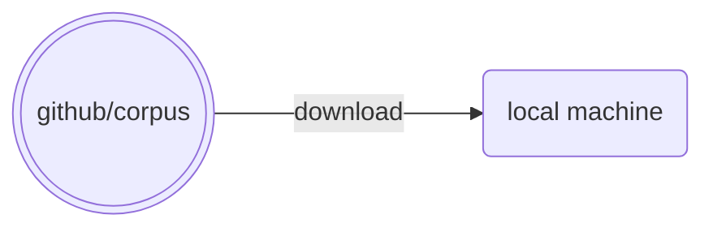
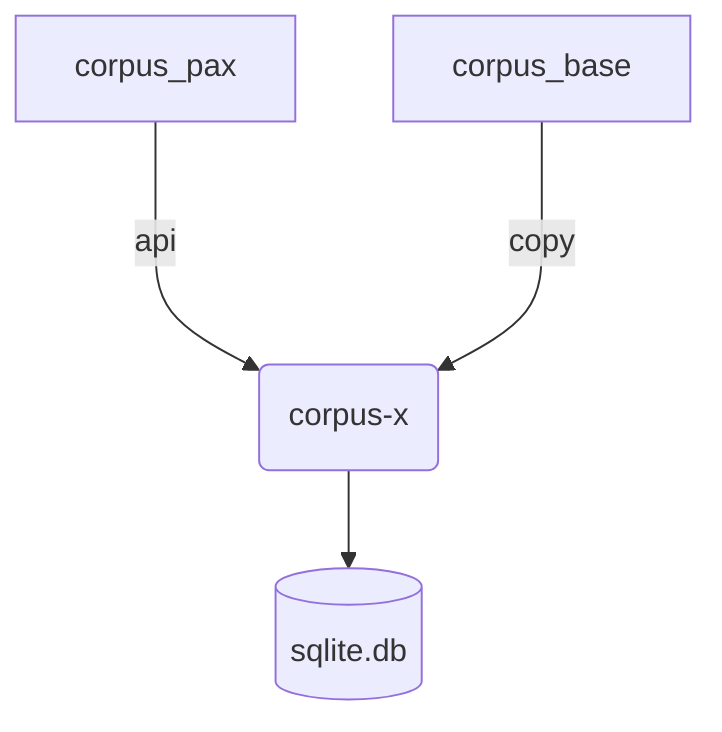
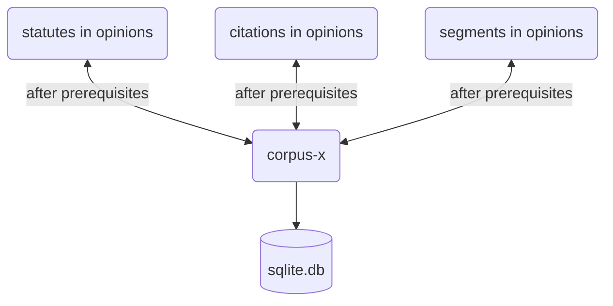
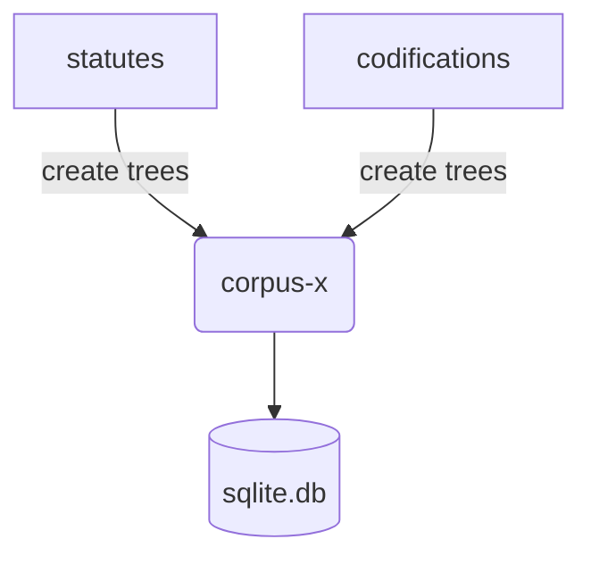
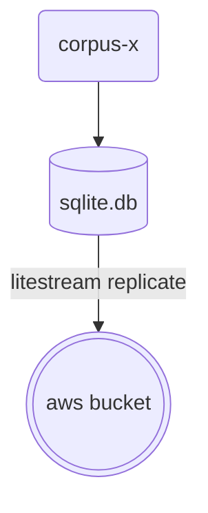

# corpus-x

## Concept

[corpus-pax](https://github.com/justmars/corpus-pax) + [corpus-base](https://github.com/justmars/corpus-base) + [statute-trees](https://github.com/justmars/statute-trees) = converts raw `yaml`-based corpus repository to its database variant **corpus-x**; see [details](notebooks/setup.ipynb). After constructing all of the required tables, it becomes possible to [evaluate the raw data](docs/5-db-evaluate.md).

## Flow

### Local files

Download *.yaml files from repository:



### Prerequisites



### Inclusions



### Trees



### Replication



## Mode

Order | Time | Instruction | Docs
:--:|:--:|--:|:--
1 | ~6sec (if with test data) | [corpus-pax](https://github.com/justmars/corpus-pax#read-me) pre-requiste before `corpus-base` can work. |[Setup](docs/1-setup.md)
2 | ~20min | [corpus-base](https://github.com/justmars/corpus-base#read-me) pre-requiste before `corpus-x` can work. |[Setup](docs/1-setup.md)
3 | ~70min | If inclusion files not yet created, run script to generate. |[Pre-inclusions](docs/2-pre-inclusions.md)
4 | ~30min | Assuming inclusion files are already created, can populate the various tables under `corpus-x` | [Post-inclusions](docs/3-post-inclusions.md)
5 | ~40 to ~60min | Litestream output `x.db` on AWS bucket | [Replicated db](docs/4-aws-replicate.md)

## Build from scratch

Assuming step 3 above has already been completed as a separate process and `pax_` and `_sc_` tables have already been added:

```python shell
>>> from corpus_x import setup_x
>>> from sqlpyd import Connection
>>> c = Connection(DatabasePath="x.db", WAL=True)
>>> setup_x('x.db') # creates the database in present working directory
```

The produced `x.db` file can then be [replicated](docs/4-aws-replicate.md) to aws via litestream, which should take another hour.

## Limited to 3.11.0

See [citation-report](https://github.com/justmars/citation-report) on reason why Python version is limited to `3.11.0` in both:

1. [pyproject.toml](pyproject.toml); and
2. [github workflow](.github/workflows/main.yml)

## From Local Files to DB

See prior [documentation](https://github.com/justmars/corpus-base) for corpus-base tables.

### Statutes

#### Statute path/s

All statutes are sourced from a parent `/statutes`

Each child folder of the parent is a category /statutes/`ra`, /statutes/`roc`, etc

Each child folder of a category is the *identifier* of the statute so in cases where variants are employed, can distinguish
via a suffix integer, e.g. statutes/am/`00-5-03-sc-1` and  statutes/am/`00-5-03-sc-2`.

#### Statute creation and population

It takes about **15 minutes** to populate all the statute tables.

```python shell
>>> from corpus_x.statutes import Statute, StatuteFoundInUnit, Connection
>>> c = Connection(DatabasePath="x.db", WAL=True)
>>> Statute.make_tables(c)
>>> Statute.add_rows(c)
>>> StatuteFoundInUnit.update_statute_ids(c)
<sqlite3.Cursor object at 0x10ca544d0>
```

### Codifications

#### Codification path/s

All codifications are sourced from a parent `/codifications`

Each child folder of the parent is a category /codifications/`ra`, /codifications/`roc`, etc

Each child folder of a category is the *serial id* of such category, e.g. /codifications/ra/`386`

Each file in the latter folder is named after its identifier, e.g. `mv-civil-v1.yaml`

#### Codification creation and population

It takes about **~3 minutes** to populate all the codification tables.

```python shell
>>> from corpus_x.statutes import Codification, CodeRow, Connection
>>> c = Connection(DatabasePath="x.db", WAL=True)
>>> Codification.make_tables(c)
>>> Codification.add_rows(c)
[
    'mv-2022-pd-603-modern-child-and-youth-welfare-code-v1',
    'mv-2022-pd-612-modern-insurance-code-v1',
    'mv-2022-pd-442-labor-code-of-the-philippines-v1',
    'mv-2022-bp-129-judiciary-reorganization-act-v1',
    'mv-2022-ca-146-modern-public-service-act-v1',
    'mv-2022-act-3815-revised-penal-code-of-the-philippines-v1',
    'mv-2022-ra-7160-local-government-code-v1',
    'mv-2022-ra-8491-modern-flag-code-v1',
    'mv-2022-ra-8293-intellectual-property-code-v1',
    'mv-2022-ra-7610-child-abuse-act-v1',
    'mv-2022-ra-11232-revised-corporation-code-of-the-philippines-v1',
    'mv-2022-ra-8424-the-tax-code-v1',
    'mv-2022-ra-9160-anti-money-laundering-act-v1',
    'mv-2022-ra-9485-modern-anti-red-tape-act-v1',
    'mv-2022-ra-8550-fisheries-code-v1',
    'mv-2022-ra-9344-juvenile-justice-and-welfare-act-of-2006-v1',
    'mv-2022-ra-7042-modern-foreign-investments-acts-v1',
    'mv-2022-ra-9165-comprehensive-dangerous-drugs-act-of-2002-v1',
    'mv-2022-ra-386-modern-civil-code-v1',
    'mv-2022-const-1987-the-1987-constitution-of-the-philippines-v1',
    'mv-2022-rule-am-19-10-20-sc-revised-rules-of-civil-procedure-v1',
    'mv-2022-rule-am-19-08-15-sc-revised-rules-on-evidence-roc-v1',
    'mv-2022-rule-am-00-5-03-sc-revised-rules-of-criminal-procedure-roc-v1',
    'mv-2022-roc-1964-special-proceedings-roc-v1',
    'mv-2022-roc-1964-legal-and-judicial-ethics-roc-v1',
    'mv-2022-eo-292-the-administrative-code-v1',
    'mv-2022-eo-209-the-family-code-of-the-philippines-v1'
]
```

### Decision inclusions

#### Concept of inclusions

Each opinion declared via `corpus_base` will contain references to:

1. statutes;
2. citations; and
3. segments.

We'll use these references by first generating an inclusion `yaml` file for each opinion to serve as future rows to `corpus_x`-related tables:

1. `opinion_statutes`
2. `opinion_citations`
3. `opinion_segments`

#### Inclusion path/s

All decisions are sourced from a parent `/decisions`

Each child folder of the parent is one of 2 categories: (1) /decisions/`sc` and (2) /decisions/`legacy`

Each child folder of a category is a decision identifier, e.g. decisions/sc/`1234`; it contains a decision's content.

The inclusion file for each decision will be stored in this identifier folder.

#### Creation of inclusion files

##### Populate local files

```python shell
>>> from sqlpyd import Connection
>>> c = Connection(DatabasePath='x.db', WAL=True) # assuming x.db is the file
>>> from corpus_x.inclusions import create_inclusion_files_from_db_opinions
>>> create_inclusion_files_from_db_opinions(c) # will use sc_tbl_opinions
# Set inclusions... ━━━━━━╺━━━━━━━━━━━━━━━━━━━━━━━━━━━━━━━━━  16% 1:10:21
```

It takes **~60-90 minutes** to parse through **60k** long form pieces of text.

Note: it used to take 6 hours; the optimization of the codebase via `statute-patterns` has significantly cut down on the time.

This process should be called whenever here is change in the opinions table.

##### Pull from local files to database

We can now proceed to insert rows from the `inclusion.yaml` file to the proper tables.

It takes about **~20 minutes** to populate all the inclusion tables.

```python shell
>>> from corpus_x import Inclusion
>>> Inclusion.from_files_to_db(c)
>>> StatuteInOpinion.add_statutes(c)  # eta ~2 minutes to store 500 objects
>>> StatuteInOpinion.update_statute_ids(c)
>>> CitationInOpinion.update_decision_ids(c)
```

### Segment discovery

The [segmenting function](../corpus_x/utils/segmentize.py) determines the kind of rows that becomes associated with an opinion and a decision.

#### Search for qualifying segments

The `char_count` can be used to limit the number of segments:

```sql
select count(id)
from sc_tbl_segments
where char_count >= 500
```

`char_count` is the SQL column per segment.

#### Limit input of segments

`MIN_LENGTH_CHARS_IN_LINE` is the python filtering mechanism that determines what goes into the database. Assuming a minimum of only 20 characters, the number of segment rows can be as many as ~2.9m.

`MIN_LENGTH_CHARS_IN_LINE` | Total Num. of Rows | Time to Create from Scratch
:--:|:--:|:--:
20 | ~2.9m | 1.5 hours
500 | ~700k | 40 minutes
1000 | ~170k | TBD

We will settle with `500` until we come up with a better segmentizing algorithm.

#### Number of segments per decision

```sql
select decision_id, count(id)
from sc_tbl_segments
where char_count >= 500
group by decision_id
```

## Replication to AWS

### Config file

View the [litestream config file](litestream.yml) which lists down the various env variables that need to be set:

var | desc | notes
--:|:--|--
`LITESTREAM_ACCESS_KEY_ID` | aws access id | starts with `AKIA`
`LITESTREAM_SECRET_ACCESS_KEY` | aws secret key | see password manager
`REPLICA_URL` | must have an aws s3 bucket | s3://bucket/path
`DB_FILE` | the db path | *.db that will be replicated to the aws s3 bucket

### Set credentials that config will use

Enter the shell and export the proper values:

```sh
poetry shell
export DB_FILE=a-name-of-a-db.db
export LITESTREAM_ACCESS_KEY_ID=AKIAxxx
export LITESTREAM_SECRET_ACCESS_KEY=xxx
export REPLICA_URL=s3://bucket/path
```

### Use config to litestream local db to aws bucket

Run the following replication command:

```console
litestream replicate -config litestream.yml
```

This will produce the following lines:

```console
litestream v0.3.9
initialized db: /path/to/db/x.db
replicating to: name="s3" type="s3" bucket="corpus-x" path="db" region="" endpoint="" sync-interval=1s
path/to/db/x.db: sync: new generation "xxxxxxxx", no generation exists
```

### Nonitor upload

See replication / upload progress in MacOS's *Activity Monitor* / *Network* panel.

Considering the size of the database, it will take sometime to upload.

After the replication, the following line should appear in the console:

```console
path/to/db/x.db(s3): snapshot written xxx/00000000
```

### Check successful replication

View the aws s3 [bucket](https://s3.console.aws.amazon.com/s3/buckets/) and confirm existence of a new generation.

## Evaluation

### Decision

```python
>>> from sqlpyd import Connection
>>> from corpus_x import get_decision
>>> case_pk = "gr-l-63915-apr-24-1985-136-scra-27-220-phil-422"
>>> case_detail = get_decision(Connection(DatabasePath="x.db"), case_pk)
>>> print(case_detail)
{
    'created': 1662986006.2967641,
    'modified': 1662986006.2967641,
    'title': 'Lorenzo M. Tañada, Abraham F. Sarmiento, and Movement Of Attorneys For Brotherhood, Integrity And Nationalism, Inc.  [MABINI], Petitioners, Vs. Hon. Juan C. Tuvera' x x x,
    'description': 'GR L-63915, Apr. 24, 1985, 136 SCRA 27, 220 Phil. 422',
    'date': '1985-04-24',
    'justice_id': 101,
    'per_curiam': 0,
    'composition': 'En Banc',
    'category': 'Decision',
    'author_list': [{'id': 'mv', 'display': 'Marcelino Veloso III', 'img': 'members-mv'}],
    'opinions_list': [
        {
            'opinion_id': 'c6812-100',
            'title': 'Concurring Opinion',
            'justice_id': 100,
            'text': x x x,
            'statutes': [],
            'unmatched_statutes': [],
            'decisions': [],
            'unmatched_decisions': []
        },
        x x x # different opinions with their respective text and citations
        {
            'opinion_id': 'c6812-main',
            'title': 'Ponencia',
            'justice_id': 101,
            'text': x x x,
            'statutes': [
                {
                    'id': 'ra-386-june-18-1949',
                    'official_title': 'An Act to Ordain and Institute the Civil Code of the Philippines',
                    'serial_title': 'Republic Act No. 386',
                    'statute_date': '1949-06-18'
                }
            ],
            'unmatched_statutes': [{'statute_category': 'ca', 'statute_serial_id': '638'}], # this implies that there is no statute presently existing in the database having the above category and serial id
            'decisions': [ # each decision
                {
                    'id': 'gr-l-52245-jan-22-1980-180-phil-369',
                    'title': 'Patricio Dumlao, Romeo B. Igot, And Alfredo Salapantan, Jr., Petitioners, Vs. Commission On Elections, Respondent.',
                    'description': 'GR L-52245, Jan. 22, 1980, 180 Phil. 369',
                    'date': '1980-01-22'
                },
                x x x # each decision in the opinion can be linked
            ],
            'unmatched_decisions': [
                {'docket': None, 'scra': None, 'phil': '45 Phil. 345', 'offg': None},
                {'docket': None, 'scra': '16 SCRA 151', 'phil': None, 'offg': None},
                {'docket': None, 'scra': '18 SCRA 924', 'phil': None, 'offg': None},
                x x x # this implies that there is no decision presently existing in the database having the citations itemized
            ]
        }
    ]
}
```

### Codification

With respect to a codification_id:

```python
>>> from sqlpyd import Connection
>>> from corpus_x import get_codification
>>> code_pk = "gr-l-63915-apr-24-1985-136-scra-27-220-phil-422"
>>> code_detail = get_codification(Connection(DatabasePath="x.db"), code_pk)
>>> print(code_detail)
{
    'created': 1668327185.4456773,
    'modified': 1668327185.4456773,
    'title': 'Judiciary Reorganization Act',
    'description': 'The most recent statute designating jurisdiction of general courts in the Philippines.\n',
    'date': '2022-10-01',
    'statute_category': 'bp',
    'statute_serial_id': '129',
    'statute_id': 'bp-129-august-14-1981',
    'statute_date': '1981-08-14',
    'statute_titles': [
        {'title': 'The Judiciary Reorganization Act of 1980', 'category': 'short'},
        {'title': 'Batas Pambansa Blg. 129', 'category': 'serial'},
        {
            'title': 'An Act Reorganizing The Judiciary, Appropriating Funds Therefor, And For Other Purposes.',
            'category': 'official'
        } # these are the ways that this statute is referred to
    ],
    'units': [
        { # this is the nested tree that can be styled via html / css / js
            'item': 'Judiciary Reorganization Act',
            'id': '1.', # why necessary to create a root node? easier to create relationships, i.e. repeals / associations of whole documents to a single unit node
            'units': [
                {
                    'item': 'Container 1',
                    'caption': 'Preliminary Chapter',
                    'id': '1.1.',
                    'units': [
                        {
                            'item': 'Section 1',
                            'caption': 'Title.',
                            'content': 'This Act shall be known as "The Judiciary Reorganization Act of 1980."',
                            'id': '1.1.1.',
                            'units': []
                        },
                    ],
                    x x x
                },
                x x x
            ],
        },
        x x x,
    ],
    'author_list': [{'id': 'mv', 'display': 'Marcelino Veloso III', 'img': 'members-mv'}],
    'event_statute_affectors': [
        {
            'id': 'ra-11576-july-30-2021',
            'official_title': 'An Act Further Expanding The Jurisdiction Of The Metropolitan Trial Courts, Municipal Trial Courts In Cities, Municipal Trial Courts, And Municipal Circuit Trial Courts, Amending For The Purpose Batas Pambansa Blg. 129, Otherwise Known As "The Judiciary Reorganization Act Of 1980," As Amended\n',
            'serial_title': 'Republic Act No. 11576',
            'statute_date': '2021-07-30'
        },
        {
            'id': 'ra-11455-august-30-2019',
            'official_title': 'An Act Creating Two (2) Additional Branches Of The Regional Trial Court In The Province Of Sultan Kudarat, One Each To Be Stationed In The Municipality Of Isulan And Tacurong City, Further Amending For The Purpose Section 14, Paragraph (M) Of Batas Pambansa Blg. 129, Otherwise Known As "The Judiciary Reorganization Act Of 1990," As Amended And Appropriating Funds Therefor',
            'serial_title': 'Republic Act No. 11455',
            'statute_date': '2019-08-30'
        },
        x x x  # these are the different statutes that affect the base statute bp 129
    ]
}
```
