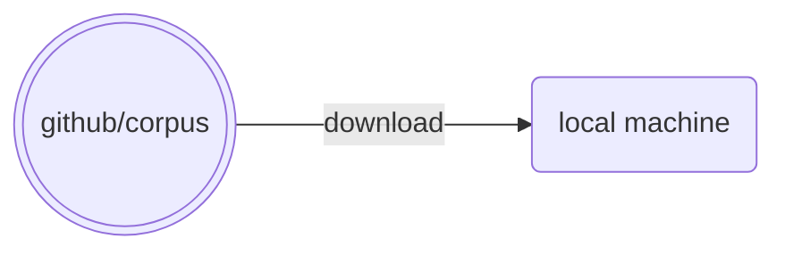
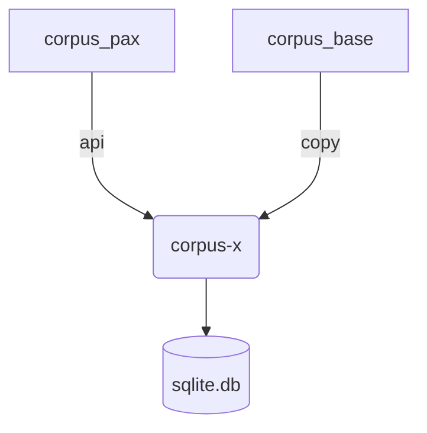
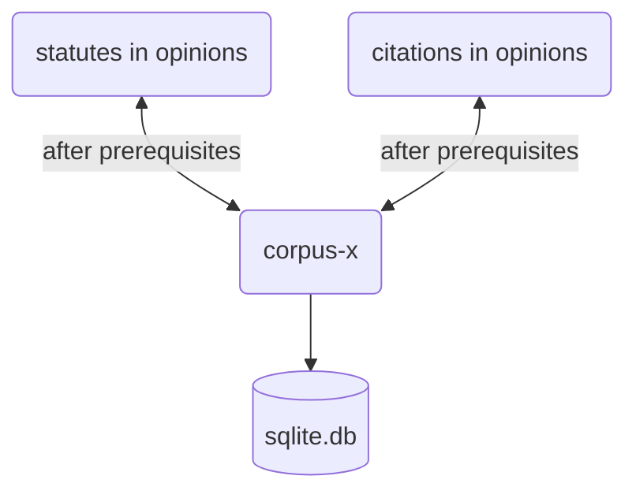
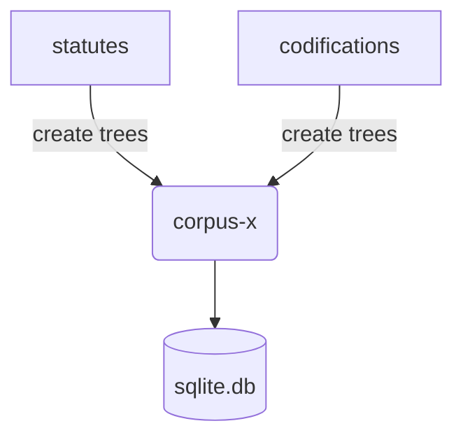
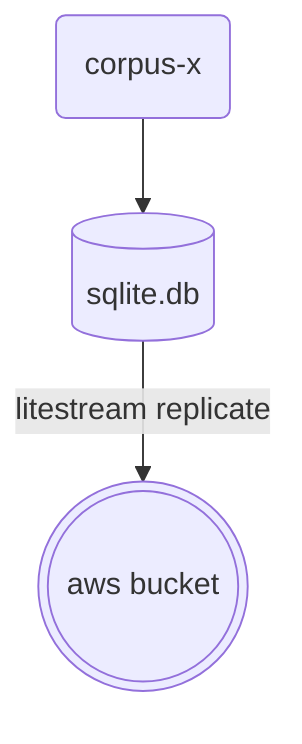

# Flow

## Local files

Download *.yaml files from repository:

```mermaid
flowchart LR
repo(((github/corpus))) --download---> local(local machine)
```

## Prerequisites

```mermaid
flowchart TD
corpus_pax--api--->x
corpus_base--copy--->x
x(corpus-x)-->db[(sqlite.db)]
```

## Inclusions

```mermaid
flowchart TD
op_stat(statutes in opinions)<--after prerequisites-->x
op_cite(citations in opinions)<--after prerequisites-->x
x(corpus-x)-->db[(sqlite.db)]
```

## Trees

```mermaid
flowchart TD
statutes--create trees-->x
codifications--create trees-->x
x(corpus-x)-->db[(sqlite.db)]
```

## Replication

```mermaid
flowchart TD
  x(corpus-x)-->db[(sqlite.db)]
  db--litestream replicate-->aws(((aws bucket)))
```
